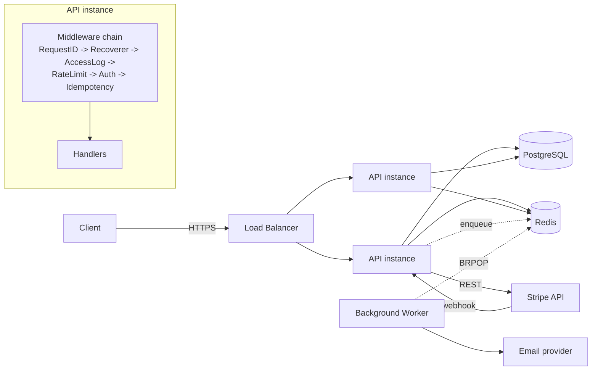

# Architecture

## Request flow

## Why these choices

**No ORM.** `database/sql` + `lib/pq` with hand-written SQL. On a
transactional/financial-adjacent backend (see `transaction-service` for
the pattern this continues), being able to read the exact query that
will run — not a generated one — matters more than the convenience of an
ORM. It also means zero surprises around N+1 queries or hidden lazy
loading.

**Opaque refresh tokens, JWT access tokens.** Access tokens are
short-lived, stateless JWTs — no DB hit to validate one. Refresh tokens
are random opaque strings, stored server-side as a SHA-256 hash, which
makes them revocable (logout, "sign out everywhere", suspected
compromise) in a way a pure-JWT refresh scheme can't be without an
additional blocklist anyway. Rotation on every refresh means a replayed
stolen refresh token is single-use.

**Multi-tenancy via a `memberships` join table**, not a `tenant_id`
column on every row. Real products need users to belong to more than one
org (agencies, contractors, multi-brand companies) — modeling it as
`users <-> organizations` from day one avoids a painful migration later.
Role checks (`owner` > `admin` > `member`) live in one place
(`tenant.RequireRole` middleware) rather than being re-implemented per
handler.

**Redis-backed rate limiting and idempotency, not in-memory.** An
in-process map works until you run two instances behind a load balancer,
at which point it silently stops limiting anything. Redis makes both
correct under horizontal scaling from the start, and it's already a
dependency for the job queue.

**A hand-rolled job queue instead of a full library.** BRPOP-based, ~100
lines, one Redis dependency already in the stack. It covers the actual
requirement (don't block an HTTP response on sending an email) without
asking a client to additionally operate and reason about a library like
asynq. The queue interface (`Enqueue`/`Register`) is small enough to
swap the implementation later without touching call sites.

**Direct Stripe REST calls instead of the stripe-go SDK.** Three
endpoints (checkout session, billing portal, webhook verification)
covers the full subscription lifecycle this kit needs. Webhook signature
verification is implemented by hand against Stripe's documented HMAC
scheme — it's ~40 lines and removes a dependency for something this
security-critical to understand fully rather than trust as a black box.

**`/healthz` vs `/readyz`.** Liveness never touches the database — a
slow Postgres shouldn't get a healthy process killed by its
orchestrator. Readiness checks both Postgres and Redis, so a load
balancer stops sending traffic to an instance that's up but can't
actually serve requests.

## What's deliberately out of scope for a starter kit

- Email verification flow (signup issues `verified: false`; wire up your
  provider of choice and flip it via a normal PATCH-style endpoint).
- A full RBAC permission matrix beyond the three roles — most SaaS
  products don't need more until they have enterprise customers asking
  for it specifically.
- Distributed tracing — the structured `log/slog` output already carries
  a request ID per line; wiring that into OpenTelemetry is a follow-up
  once you have multiple services to trace across, not before.
